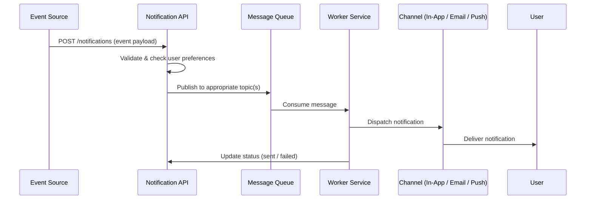

# Notification System Design

## 1. Overview

This document outlines the architecture and design for a real-time notification system. The system is responsible for generating, delivering, and managing notifications across multiple channels (in-app, email, push, SMS).

---

## 2. Goals

- **Real-time delivery** — Notifications should reach users with minimal latency.
- **Multi-channel support** — Support in-app, email, push notifications, and SMS.
- **Scalability** — Handle high throughput as the user base grows.
- **Reliability** — Ensure at-least-once delivery with retry mechanisms.
- **User preferences** — Allow users to configure notification preferences per channel and category.

---

## 3. Architecture

```
┌──────────────┐     ┌──────────────────┐     ┌───────────────────┐
│  Event Source │────▶│ Notification API  │────▶│  Message Queue    │
│  (Services)  │     │  (REST / gRPC)    │     │  (RabbitMQ/Kafka) │
└──────────────┘     └──────────────────┘     └─────────┬─────────┘
                                                        │
                                              ┌─────────▼─────────┐
                                              │  Worker Service    │
                                              │  (Consumer)        │
                                              └─────────┬─────────┘
                                                        │
                          ┌─────────────────────────────┼─────────────────────────────┐
                          │                             │                             │
                ┌─────────▼─────────┐       ┌───────────▼──────────┐      ┌───────────▼──────────┐
                │   In-App Channel  │       │   Email Channel      │      │   Push Channel       │
                │   (WebSocket/SSE) │       │   (SMTP / SendGrid)  │      │   (FCM / APNs)       │
                └───────────────────┘       └──────────────────────┘      └──────────────────────┘
```

---

## 4. Components

### 4.1 Notification API (Backend)

| Aspect       | Detail                                                        |
|--------------|---------------------------------------------------------------|
| **Purpose**  | Receives notification requests from internal services         |
| **Tech**     | Node.js / Express (or NestJS)                                 |
| **Endpoints**| `POST /notifications` — Create a notification                 |
|              | `GET /notifications/:userId` — Fetch user notifications       |
|              | `PATCH /notifications/:id/read` — Mark as read               |
|              | `DELETE /notifications/:id` — Delete a notification           |
|              | `GET /notifications/:userId/preferences` — Get preferences    |
|              | `PUT /notifications/:userId/preferences` — Update preferences |

### 4.2 Message Queue

| Aspect       | Detail                                                   |
|--------------|----------------------------------------------------------|
| **Purpose**  | Decouple notification creation from delivery             |
| **Tech**     | RabbitMQ or Apache Kafka                                 |
| **Topics**   | `notification.in-app`, `notification.email`, `notification.push` |

### 4.3 Worker Service

| Aspect       | Detail                                                   |
|--------------|----------------------------------------------------------|
| **Purpose**  | Consume messages from the queue and dispatch via channels |
| **Tech**     | Node.js worker threads or separate microservice          |
| **Retry**    | Exponential backoff with dead-letter queue (DLQ)         |

### 4.4 In-App Notification (Frontend)

| Aspect       | Detail                                                   |
|--------------|----------------------------------------------------------|
| **Purpose**  | Display real-time notifications in the UI                |
| **Tech**     | React + WebSocket (Socket.IO) or Server-Sent Events     |
| **Features** | Bell icon with unread count, notification dropdown, toast popups |

---

## 5. Data Model

### 5.1 Notification Schema

```json
{
  "_id": "ObjectId",
  "userId": "string",
  "type": "string (order_update | promo | alert | system)",
  "title": "string",
  "message": "string",
  "channel": ["in-app", "email", "push"],
  "status": "string (pending | sent | failed | read)",
  "metadata": {
    "orderId": "string",
    "actionUrl": "string"
  },
  "readAt": "Date | null",
  "createdAt": "Date",
  "updatedAt": "Date"
}
```

### 5.2 User Preferences Schema

```json
{
  "userId": "string",
  "preferences": {
    "order_update": { "in_app": true, "email": true, "push": true },
    "promo": { "in_app": true, "email": false, "push": false },
    "alert": { "in_app": true, "email": true, "push": true },
    "system": { "in_app": true, "email": false, "push": false }
  },
  "quietHours": {
    "enabled": false,
    "start": "22:00",
    "end": "08:00"
  }
}
```

---

## 6. Notification Flow



---

## 7. Folder Structure

```
23bq1a05n8/
├── logging_middleware/        # Request/response logging middleware
├── notification_app_be/       # Backend service
│   ├── config/
│   ├── controllers/
│   ├── models/
│   ├── routes/
│   ├── services/
│   ├── workers/
│   ├── middleware/
│   ├── utils/
│   ├── server.js
│   └── package.json
├── notification_app_fe/       # Frontend application
│   ├── public/
│   ├── src/
│   │   ├── components/
│   │   ├── pages/
│   │   ├── hooks/
│   │   ├── services/
│   │   ├── context/
│   │   └── App.jsx
│   └── package.json
└── notification_system_design.md
```

---

## 8. Key Design Decisions

| Decision                     | Rationale                                                    |
|------------------------------|--------------------------------------------------------------|
| Message queue for delivery   | Decouples creation from delivery; enables retry and scaling  |
| WebSocket for in-app         | Provides true real-time push without polling                 |
| Per-category preferences     | Gives users fine-grained control over notification types     |
| Exponential backoff + DLQ    | Prevents thundering herd on failures; captures failed msgs   |
| Separate FE and BE repos     | Independent deployment and scaling                           |

---

## 9. Future Enhancements

- [ ] Notification batching and digest emails
- [ ] Analytics dashboard (delivery rates, open rates)
- [ ] A/B testing for notification content
- [ ] Rate limiting per user
- [ ] Internationalization (i18n) for notification templates
- [ ] Template engine for dynamic notification content

---

## 10. Tech Stack Summary

| Layer      | Technology                          |
|------------|-------------------------------------|
| Backend    | Node.js, Express, MongoDB, Socket.IO|
| Frontend   | React, Socket.IO Client, CSS       |
| Queue      | RabbitMQ / Kafka                    |
| Email      | SendGrid / Nodemailer               |
| Push       | Firebase Cloud Messaging (FCM)      |
| Logging    | Winston / Morgan (logging middleware)|

---

*Document created: June 5, 2026*
